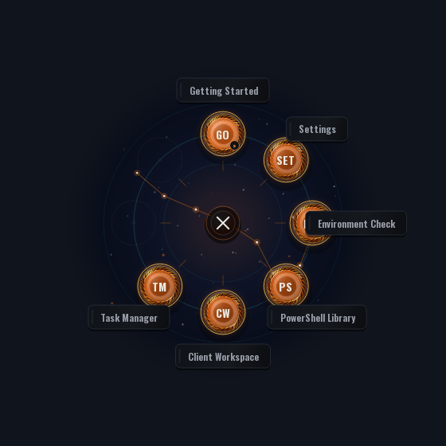
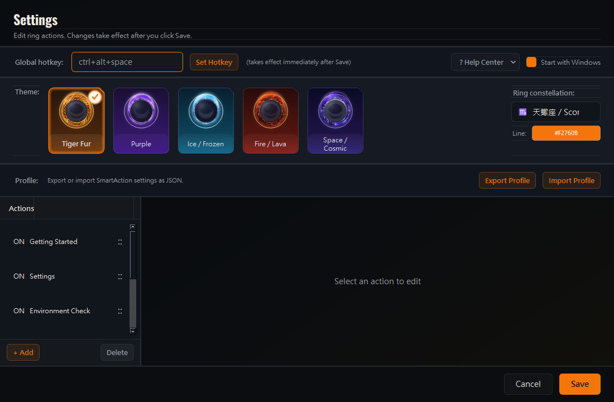

# SmartAction

> Windows 快捷操作輪盤：用全域快捷鍵，在滑鼠位置快速開啟常用程式、網站、PowerShell、自動化工具與 IT 維運功能。

SmartAction is a lightweight Windows action ring for shortcuts, automation, IT support, and repeatable desktop workflows.

[](https://github.com/tigerhzu/SmartAction/releases/latest)
[](https://www.python.org/)
[](https://doc.qt.io/qtforpython-6/)
[](https://github.com/tigerhzu/SmartAction/releases/latest)

<p align="center">
  
</p>

## 下載最新版

前往 [GitHub Releases](https://github.com/tigerhzu/SmartAction/releases/latest)，下載：

```text
SmartAction-Release-v1.2.0.zip
```

請不要使用 GitHub 的 `Code > Download ZIP` 安裝程式；那是原始碼，不是已封裝的 Windows 版本。

## 主要功能

- 使用 Windows 原生全域 Hotkey，長時間在背景執行仍能穩定叫出輪盤。
- 輪盤出現在滑鼠位置，點擊執行動作；按住動作拖曳即可順時針或逆時針旋轉。
- 12 種星座背景，可自訂星座連線與星星顏色。
- 可從輪盤直接開啟 Settings，不必回到右下角系統匣。
- 支援 URL、程式、檔案、Command、PowerShell、文字貼上、表單及子選單。
- 內建 PowerShell Library、Environment Check 與 Client Workspace。
- Emoji 圖庫移除重複膚色版本，降低載入時間與記憶體使用量。
- 設定檔支援匯入、匯出與舊版自動升級。
- 針對較慢電腦縮小動畫資源並延遲載入未使用主題。

## 快速開始

1. 下載並解壓縮 `SmartAction-Release-v1.2.0.zip`。
2. 將整個資料夾放到可寫入的位置，例如 `C:\Tools\SmartAction`。
3. 執行 `install.bat` 建立桌面、開始功能表與開機啟動捷徑。
4. 執行 `SmartAction.exe` 或 `start.bat`。
5. 按預設快捷鍵 `Ctrl + Alt + Space` 叫出輪盤。

SmartAction 啟動後會留在 Windows 系統匣。從系統匣右鍵選單也能開啟設定、重新註冊 Hotkey 或結束程式。

## 輪盤操作

- **點一下圓形動作或文字標籤**：立即執行。
- **按住動作後拖曳**：旋轉整個輪盤；放開後不會誤執行動作。
- **點中央 X**：關閉輪盤；進入子選單時中央按鈕會變成返回。
- **Settings 動作**：直接開啟設定頁。
- **最多 10 個直接槽位**：9–10 個動作時會自動調整排列。

## 設定畫面

<p align="center">
  
</p>

在 Settings 中可以：

- 修改全域快捷鍵。
- 選擇 Tiger、Purple、Ice、Lava 或 Cosmic 輪盤主題。
- 選擇 12 星座背景並調整星座顏色。
- 新增、刪除、排序及編輯輪盤動作。
- 匯出或匯入完整設定檔。
- 設定是否隨 Windows 啟動。

## 支援的動作類型

| 類型 | 用途 | 範例 |
| --- | --- | --- |
| Settings | 開啟 SmartAction 設定 | 輪盤設定入口 |
| URL | 開啟網站 | ChatGPT、YouTube、管理後台 |
| App / File | 啟動程式或檔案 | 工作管理員、工具資料夾 |
| Command | 執行命令列 | `explorer C:\Tools` |
| PowerShell | 執行 PowerShell | 維運與自動化腳本 |
| PowerShell Library | 開啟可重用腳本庫 | 建立帳號、網域工具 |
| Environment Check | 快速檢查電腦環境 | Windows、網路、DNS |
| Client Workspace | 開啟一組客戶工作頁面 | 文件、工單、管理入口 |
| Paste | 貼上常用文字 | 工單回覆、固定片語 |
| Form / PS Form | 填寫參數後產生文字或執行腳本 | IT 維運表單 |
| Folder | 建立下一層輪盤 | 將同類工具放在一起 |

## Firefox Container Helper

Release 包含 Firefox Container Helper：

1. 執行 `firefox\setup_firefox.bat` 註冊 Native Messaging Host。
2. 安裝 `firefox\firefox-helper.xpi`。
3. 重新啟動 Firefox，再從 Client Workspace 檢查 Helper。

一般 Firefox 正式版可能要求經 Mozilla 簽署的擴充套件；若 XPI 被拒絕，請改用已簽署版本或公司的擴充套件部署方式。

## 開發與建置

```bat
python -m venv .venv
.venv\Scripts\activate
pip install -r requirements.txt
python -m app.main
```

建立完整 Release：

```bat
build_release.bat
```

輸出位置：

```text
dist\SmartAction-Release-v1.2.0\
```

## 疑難排解

- **Hotkey 沒有反應**：從系統匣選擇 `Restart Hotkey`，或到 Settings 更換組合鍵。
- **設定頁沒有出現**：再次點擊輪盤上的 Settings；已最小化的設定視窗會自動恢復。
- **找不到系統匣圖示**：檢查 Windows 的隱藏圖示區域。
- **PowerShell 動作失敗**：需要修改系統設定的腳本可能要用系統管理員身分執行。
- **Firefox Helper 無法連線**：重新執行 `firefox\setup_firefox.bat`，安裝 XPI 後重啟 Firefox。

更多文件：

- [快速入門](docs/quick-start.md)
- [動作類型](docs/action-types.md)
- [設定檔匯入／匯出](docs/profile-import-export.md)
- [Firefox Container Helper](docs/firefox-container-helper.md)
- [v1.2.0 Release Notes](docs/release-notes-v1.2.0.md)

## 授權與安全提醒

SmartAction 可以執行本機命令與 PowerShell。匯入他人設定檔或腳本前，請先確認內容可信；需要系統權限的動作應只在必要時以系統管理員身分執行。
