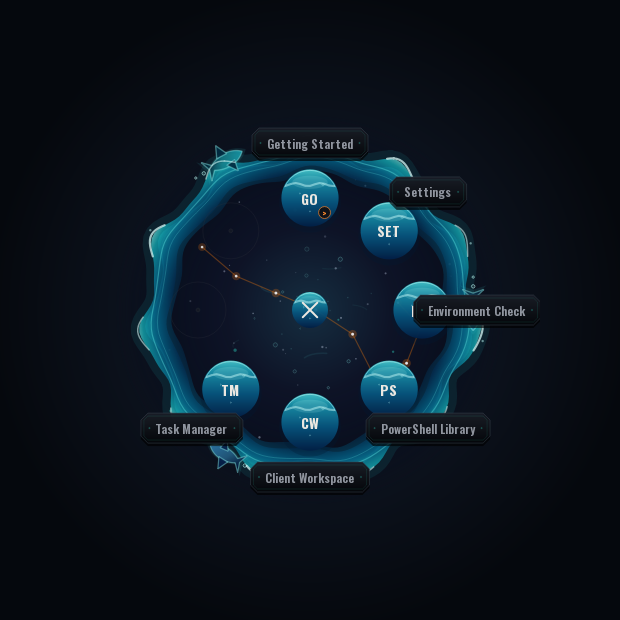
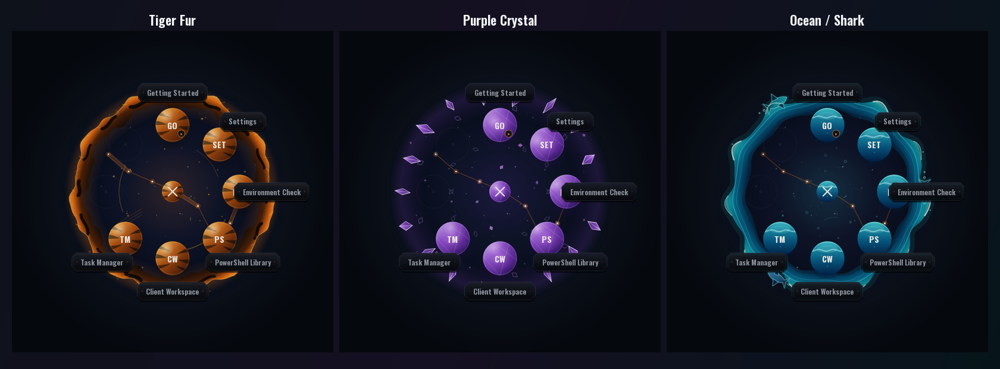
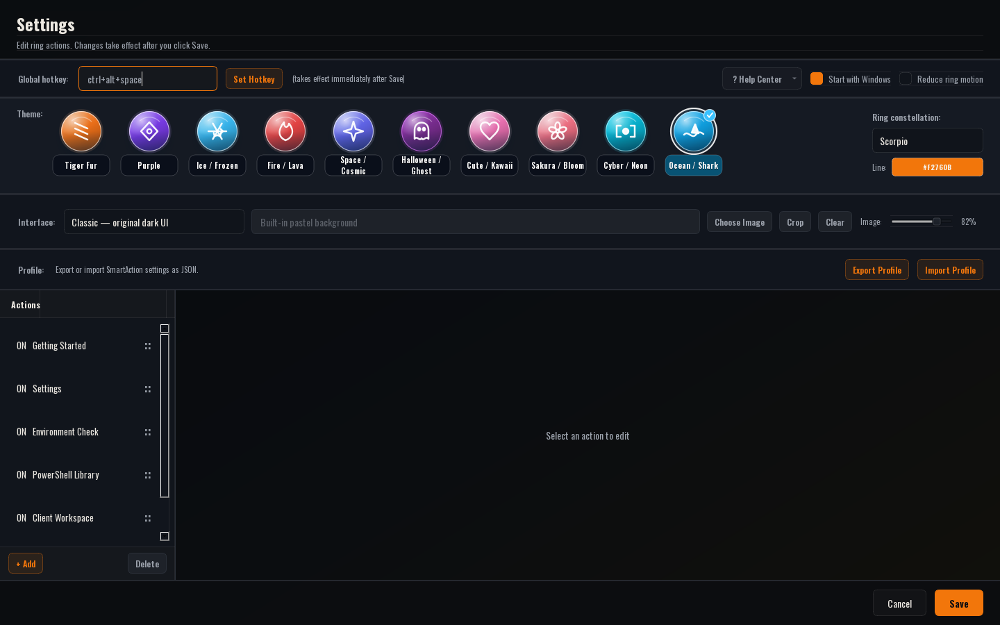

# SmartAction

> 一個為 Windows 打造的可自訂快捷操作輪盤。按下全域快捷鍵，就能在滑鼠所在螢幕快速開啟程式、網站、PowerShell 工具與日常工作流程。

SmartAction is a lightweight Windows action ring for shortcuts, automation, IT support, and repeatable desktop workflows.

[](https://github.com/tigerhzu/SmartAction/releases/latest)
[](https://github.com/tigerhzu/SmartAction/releases/latest)
[](https://www.python.org/)
[](https://doc.qt.io/qtforpython-6/)

<p align="center">
  
</p>

<p align="center">
  <a href="https://github.com/tigerhzu/SmartAction/releases/latest"><strong>下載 Windows 最新版</strong></a>
  ·
  <a href="docs/quick-start.md">快速開始</a>
  ·
  <a href="docs/help-center.md">說明中心</a>
  ·
  <a href="https://github.com/tigerhzu/SmartAction/issues">回報問題</a>
</p>

## SmartAction 可以做什麼？

SmartAction 把散落在桌面、書籤、開始功能表與 PowerShell 裡的常用工具，集中成一個可隨時叫出的輪盤。它特別適合：

- IT 維運人員快速開啟環境檢查、PowerShell 腳本與系統工具。
- 客服或工程團隊依客戶分類網站、工單、文件與遠端管理入口。
- 多螢幕使用者在目前工作的螢幕直接開啟設定與工具視窗。
- 任何想減少滑鼠移動、桌面捷徑與重複操作的 Windows 使用者。

## 主要特色

| 功能 | 說明 |
| --- | --- |
| 全域快捷鍵 | 預設 `Ctrl + Alt + Space`，長時間背景執行時會自動恢復註冊。 |
| 滑鼠位置叫出 | 輪盤與功能視窗會開在目前游標所在的螢幕。 |
| 可拖曳輪盤 | 按住輪盤動作並拖曳，可順時針或逆時針旋轉；放開不會誤執行。 |
| 10 種獨立主題 | Tiger、Purple、Ice、Lava、Cosmic、Halloween、Kawaii、Sakura、Cyber、Ocean 都有不同材質、粒子與互動動畫。 |
| 12 星座背景 | 可選星座並自訂星座連線顏色，所有主題都保留中央星空。 |
| 三套全域介面 | Classic、Cute 與互動式 Woven Light，可直接切換預覽。 |
| 自訂高清背景 | Cute 支援圖片裁切、縮放、焦點位置與透明度；未設定時使用內建高清背景。 |
| Client Workspace | 可建立工程師／客戶資料夾、上下拖曳排序，一次開啟整組工作頁面。 |
| PowerShell Library | 管理與重複使用 PowerShell 維運腳本。 |
| Profile 匯入／匯出 | 在不同電腦間備份或搬移 SmartAction 設定。 |
| Reduced Motion | 可關閉非必要動畫，兼顧較慢電腦與動態效果敏感使用者。 |

## 每個主題都有自己的視覺識別

主題不是單純換色。不同輪盤會使用虎紋能量、水晶折射、冰晶裂紋、熔岩、行星軌道、幽靈霧氣、軟糖、櫻花水波、數位 HUD 或動態海浪等不同的外圈、按鈕材質、背景粒子、Hover 與點擊回饋。

<p align="center">
  
</p>

Ocean / Shark 使用雙層動態海浪、深海水凝膠按鈕、氣泡、水下光線與鯊魚剪影；其他主題也依照相同的差異化標準設計。動畫以流暢度為優先，未使用的主題資源會延遲載入。

## 30 秒開始使用

1. 前往 [Releases](https://github.com/tigerhzu/SmartAction/releases/latest)。
2. 下載 `SmartAction-Release-v1.3.0.zip`，不要下載 GitHub 自動產生的 Source code ZIP。
3. 解壓縮完整資料夾到可寫入的位置，例如 `C:\Tools\SmartAction`。
4. 執行 `install.bat` 建立桌面、開始功能表與開機啟動捷徑，或直接執行 `SmartAction.exe`。
5. 按 `Ctrl + Alt + Space` 叫出輪盤。

SmartAction 啟動後會留在 Windows 系統匣。右鍵點擊系統匣圖示，可以開啟設定、重新註冊快捷鍵或結束程式。

> **提示：** Environment Check 需要依序檢查多個 Windows 與網路項目，執行時間可能較長，這不代表程式卡死。

## 輪盤操作

- **點一下動作按鈕或文字標籤**：立即執行。
- **按住動作後拖曳**：旋轉輪盤，不會在放開時誤啟動功能。
- **點中央 X**：關閉輪盤；進入資料夾後會變成返回按鈕。
- **點 Settings**：直接開啟設定頁。
- **多螢幕使用**：Settings、PowerShell Library、Client Workspace 等視窗會出現在叫出輪盤的螢幕。

## 設定與客製化

<p align="center">
  
</p>

在 Settings 中可以：

- 修改全域快捷鍵與 Windows 開機啟動。
- 選擇輪盤主題、星座與星座連線顏色。
- 切換 Classic、Cute 或 Woven Light 全域介面。
- 匯入圖片並自由裁切、縮放、調整位置與透明度。
- 新增、刪除、啟用、停用及拖曳排序輪盤動作。
- 建立子資料夾與多層輪盤。
- 匯出或匯入完整 Profile。
- 開啟 Reduced Motion，停用非必要動態效果。

## 支援的動作類型

| 類型 | 用途 | 範例 |
| --- | --- | --- |
| Settings | 開啟 SmartAction 設定 | 輪盤內的設定入口 |
| URL | 開啟網站 | ChatGPT、YouTube、管理後台 |
| App / File | 啟動程式或檔案 | 工作管理員、報表、工具程式 |
| Command | 執行命令列 | `explorer C:\Tools` |
| PowerShell | 執行 PowerShell | 自動化與 IT 維運腳本 |
| PowerShell Library | 開啟可重用腳本庫 | 網路、帳號與系統管理工具 |
| Environment Check | 快速檢查電腦環境 | Windows、網路、DNS、防火牆 |
| Client Workspace | 開啟一組客戶工作頁面 | 文件、工單、監控與管理入口 |
| Paste | 貼上常用文字 | 工單回覆、固定片語 |
| Form / PS Form | 填入參數後產生文字或執行腳本 | IT 維運表單 |
| Folder | 建立下一層輪盤 | 依工作類型分類工具 |

## Client Workspace

Client Workspace 可依工程師、部門或客戶建立資料夾，每個客戶與資料夾都能拖曳排序。啟動 Workspace 時，可以一次開啟該客戶需要的網站與工作頁面。

如需 Firefox Container 隔離不同客戶登入狀態，Release 內含 Firefox Container Helper：

1. 執行 `firefox\setup_firefox.bat`。
2. 安裝 `firefox\firefox-helper.xpi`。
3. 重新啟動 Firefox。

詳細設定請參考 [Client Workspace](docs/client-workspace.md) 與 [Firefox Container Helper](docs/firefox-container-helper.md)。

## 效能與隱私

- 未使用的動畫與主題素材不會一次全部載入。
- Emoji 圖庫只保留預設膚色，降低載入時間與記憶體使用。
- 可使用 Reduced Motion 關閉非必要動畫。
- SmartAction 的設定與客戶資料保存在本機，不會自動上傳。
- 執行 PowerShell、Command 或外部程式前，請確認內容與來源可信。

## 開發

需求：Windows 10/11、Python 3.12。

```bat
python -m venv .venv
.venv\Scripts\activate
pip install -r requirements.txt
python -m app.main
```

建立 Windows Release：

```bat
build_release.bat
```

輸出位置：

```text
dist\SmartAction-Release-v1.3.0\
```

## 文件

- [快速開始](docs/quick-start.md)
- [動作類型](docs/action-types.md)
- [全域 UI 與自訂背景](docs/ui-themes.md)
- [Client Workspace](docs/client-workspace.md)
- [Profile 匯入／匯出](docs/profile-import-export.md)
- [Firefox Container Helper](docs/firefox-container-helper.md)
- [v1.3.0 Release Notes](docs/release-notes-v1.3.0.md)

如果遇到問題，請到 [GitHub Issues](https://github.com/tigerhzu/SmartAction/issues) 提供 SmartAction 版本、Windows 版本、重現步驟與畫面截圖。
