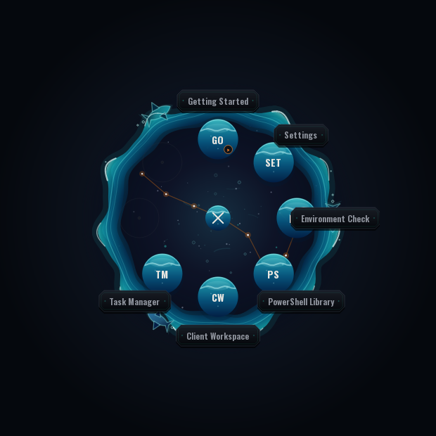
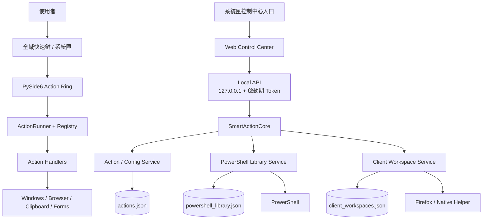
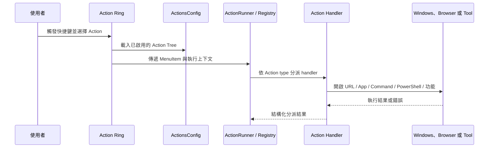

# SmartAction

> Windows 的本機優先工作入口：用全域快速鍵叫出動作輪盤，集中啟動網站、應用程式、PowerShell、客戶工作區與可重複的桌面流程。

[](https://github.com/tigerhzu/SmartAction/releases/latest)
[](https://github.com/tigerhzu/SmartAction/releases/latest)
[](https://www.python.org/)
[](https://doc.qt.io/qtforpython-6/)

<p align="center">
  
</p>

## SmartAction 是什麼？

SmartAction 是一套 Windows tray-first 桌面工具。它常駐在系統匣，透過全域快速鍵在滑鼠所在螢幕顯示徑向 Action Ring；使用者可從同一入口執行網址、程式、命令、PowerShell、剪貼簿內容、表單及客戶工作流程。

它解決了常用工具散落在桌面捷徑、瀏覽器書籤、命令列與維運文件中，導致反覆搜尋、切換視窗及重複輸入的問題。Action 是可管理的資料，而不是寫死在 UI 裡的按鈕。

## 主要功能

| 功能 | 說明 |
| --- | --- |
| Action Ring | 全域快速鍵、滑鼠所在螢幕、多層資料夾、點擊／拖曳區分與多種視覺主題。 |
| Web Control Center | 在預設瀏覽器管理設定、Action、設定檔、PowerShell 腳本庫及 Client Workspace。 |
| Action Manager | 建立、編輯、啟用、刪除、排序與巢狀管理 Action。 |
| PowerShell Library | 腳本、參數、管理員需求及風險等級都以資料管理；危險操作需確認。 |
| Client Workspace | 依客戶或工作情境整理網址、Firefox profile／container，並可搭配 Firefox Native Messaging Helper。 |
| Profile | 匯出／匯入動作、設定、腳本庫與工作區；匯入前會建立本機備份。 |
| 可攜式設定 | JSON 以原子寫入保存；發行版的使用者資料與程式資產分離。 |

## 系統架構


```mermaid
flowchart TD
    User[使用者] --> Hotkey[全域快速鍵 / 系統匣]
    Hotkey --> NativeUI[PySide6 Action Ring]
    NativeUI --> Runner[ActionRunner + Registry]
    Runner --> Handlers[Action Handlers]
    Handlers --> External[Windows / Browser / Clipboard / Forms]

    Tray[系統匣控制中心入口] --> Browser[Web Control Center]
    Browser --> LocalAPI[Local API\n127.0.0.1 + 啟動期 Token]
    LocalAPI --> Core[SmartActionCore]
    Core --> ActionService[Action / Config Service]
    Core --> PSService[PowerShell Library Service]
    Core --> WorkspaceService[Client Workspace Service]
    ActionService --> ActionStore[(actions.json)]
    PSService --> PSStore[(powershell_library.json)]
    WorkspaceService --> WorkspaceStore[(client_workspaces.json)]
    PSService --> PowerShell[PowerShell]
    WorkspaceService --> Firefox[Firefox / Native Helper]
```

桌面 UI 只負責輪盤、系統匣、全域快捷鍵與視覺呈現；Web Control Center 是同一台電腦上的 presentation layer。它不直接取得檔案系統或 subprocess 權限，所有設定與具權限操作都經由 `SmartActionCore` 的明確服務邊界處理。

## Action 執行流程


```mermaid
sequenceDiagram
    participant U as 使用者
    participant R as Action Ring
    participant C as ActionsConfig
    participant D as ActionRunner / Registry
    participant H as Action Handler
    participant T as Windows、Browser 或 Tool

    U->>R: 觸發快捷鍵並選擇 Action
    R->>C: 載入已啟用的 Action Tree
    R->>D: 傳遞 MenuItem 與執行上下文
    D->>H: 依 Action type 分派 handler
    H->>T: 開啟 URL / App / Command / PowerShell / 功能
    T-->>H: 執行結果或錯誤
    H-->>D: 結構化分派結果
```

Action 定義使用 JSON tree，核心欄位包括 `id`、`label`、`type`、`target`、`enabled` 與 `sub_actions`。目前支援：`folder`、`settings`、`url`、`app`、`command`、`powershell`、`powershell_library`、`environment_check`、`client_workspace`、`paste`、`form` 與 `ps_form`。

## 專案結構

```text
SmartAction/
├─ app/                    # 程式入口與 QApplication 生命週期
├─ core/                   # Action、設定、服務、儲存、Profile、Local API
│  ├─ actions/             # 各 Action handler 與 Registry
│  ├─ scripts/             # 內建 PowerShell 表單腳本
│  ├─ smartaction_core.py  # Core composition facade
│  └─ local_api.py         # loopback HTTP adapter
├─ ui/                     # PySide6 Ring、系統匣與視覺主題
├─ web_control_center/     # HTML / CSS / JS 管理介面
├─ config/                 # Action Ring 設定
├─ data/                   # 腳本庫、客戶工作區與 Emoji 資料
├─ resources/              # 啟動等小型 runtime 設定
├─ extensions/             # Firefox Helper extension 原始碼
├─ native/                 # Firefox Native Messaging Host
├─ assets/                 # 字型、主題與 UI 素材
├─ tools/                  # 建置、發布與資料生成工具
├─ tests/                  # 回歸、Core service 與 Local API 測試
└─ docs/                   # 使用與發布文件
```

## 核心模組

- `core/actions_config.py`：Action tree 與 Ring 設定的讀寫、遷移與相容 API。
- `core/action_service.py`、`core/action_contracts.py`：Action schema 驗證與 CRUD／排序服務。
- `core/action_runner.py`、`core/actions/`：由 Registry 分派 Action handler，避免集中式條件判斷。
- `core/smartaction_core.py`：組合 transport-neutral 的 Core services。
- `core/local_api.py`：僅監聽 `127.0.0.1` 的已驗證 Local API，供 Web Control Center 使用。
- `core/powershell_service.py`：管理與執行 PowerShell Library，回傳結構化結果。
- `core/client_workspace_service.py`：客戶、資料夾、Firefox profile／container 與 Helper 工作流。
- `core/atomic_json.py`：以暫存檔、`fsync`、`os.replace` 進行原子 JSON 寫入。

## Configuration

開發模式下，可寫入的 runtime 資料位於專案根目錄；發行版則位於 `SmartAction.exe` 同層，讓重新安裝不覆蓋使用者資料。

| 路徑 | 用途 |
| --- | --- |
| `config/actions.json` | 全域快捷鍵、輪盤主題與 Action tree。 |
| `data/powershell_library.json` | 腳本庫及其參數／風險中繼資料。 |
| `data/client_workspaces.json` | Client Workspace、資料夾及網址。 |
| `resources/config.json` | 啟動與舊版相容設定。 |

請將個人路徑、客戶網址、帳密與 token 視為本機設定；不要將實際值提交到 Git。`.env`、私鑰、憑證、credential／secret 檔案與常見 cache／build 輸出已納入 `.gitignore`。

## 安裝方式

一般使用者請從 [Releases](https://github.com/tigerhzu/SmartAction/releases/latest) 下載 Windows portable ZIP，完整解壓到可寫入目錄，例如 `C:\Tools\SmartAction`，再執行 `install.bat` 或 `SmartAction.exe`。

SmartAction 預設會常駐系統匣。需要 Firefox Container 整合時，依照 [Firefox Container Helper](docs/firefox-container-helper.md) 安裝 extension 與 Native Messaging Host。

## 開發方式

需求：Windows 10/11、Python 3.12、PowerShell，以及可選的 PyInstaller（建立發行版時使用）。

```powershell
python -m venv .venv
.venv\Scripts\Activate.ps1
pip install -r requirements.txt
python -m unittest discover -s tests -p "test_*.py"
```

建立 portable release：

```bat
build_release.bat
```

## 啟動方式

原始碼模式：

```powershell
python -m app.main
```

啟動後按已設定的全域快捷鍵（新設定預設為 `Ctrl + Space`）顯示輪盤。從系統匣選擇控制中心，會在預設瀏覽器開啟本機 Web Control Center。

## 使用方式

1. 在 Ring 選擇 Action；點擊執行，拖曳可旋轉輪盤而不誤觸執行。
2. 在 Control Center 的「動作管理」新增或整理 Action tree。
3. 在「PowerShell 腳本庫」審閱腳本、填入參數，並確認危險操作。
4. 在「客戶工作區」管理客戶網址與 Firefox Container／Helper 設定。
5. 使用「設定檔」匯出備份，或在匯入前確認它會取代既有本機設定。

## Security Notes

- Local API 固定綁定 `127.0.0.1`，不接受外部網路介面；每次啟動建立隨機 token，Web token 放在 URL fragment，不寫入 server access log。
- Web Control Center 的 CSP 僅允許同源靜態資源與 API 連線；它不直接執行 PowerShell、存取檔案或啟動外部程式。
- JSON 設定以原子寫入保存；Profile 匯入會先備份，並在完成後重新載入已啟用服務。
- PowerShell 腳本是具權限的本機操作。危險腳本需確認，password 類參數會在輸出與預覽中遮罩；仍請只執行可信來源的腳本。
- `Command`、`App / File`、一般 `PowerShell` Action 可啟動外部目標。發佈或分享設定檔前，請先移除個人路徑、客戶 URL、帳密及敏感參數。

## Project Status

目前公開發行版本為 `v1.4.0`。此版本導入以 Core service 與 authenticated loopback API 為基礎的 Web Control Center，取代舊式大型原生管理視窗，並已加入 Core／API／Web cutover 回歸測試。

相關文件：[快速開始](docs/quick-start.md)、[Action 類型](docs/action-types.md)、[Client Workspace](docs/client-workspace.md)、[Profile 匯入／匯出](docs/profile-import-export.md)、[建置與發布](docs/build-and-release.md)。
