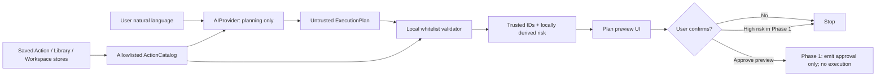

# SmartAction AI Agent：架構分析與第一階段設計

文件狀態：Phase 1 foundation implemented on `feature/ai-agent-foundation`

適用基線：SmartAction v1.0.0

Schema version：`1.0`

## 1. 決策摘要

SmartAction AI Agent 採用「規劃層」而不是「新執行引擎」。AI Provider 只把自然語言轉成結構化 execution plan；本機 validator 再將每個 step 解析到使用者已儲存、已啟用的 SmartAction 資源。只有通過驗證、顯示預覽並取得確認的計畫，未來才可交給既有 Action／Workspace 系統執行。

第一階段只提供離線 Mock Provider、資料模型、catalog、allowlist validator 與預覽 UI。它沒有 OpenAI SDK、沒有網路呼叫、沒有 API Key，也沒有 execution adapter，因此核准預覽後仍不會執行任何動作。

## 2. 現有架構分析

### 2.1 啟動與 UI

- `app/main.py` 是 source entry，負責 single-instance lock 與建立 `Application`。
- `app/application.py` 的 `Application(QApplication)` 管理 tray、hotkey、Ring 與各功能 Dialog 的生命週期。
- `ui/tray_icon.py` 是常駐入口；`ui/ring_ui.py` 是 hotkey 顯示的 radial launcher。
- `ui/settings_window.py` 編輯 Ring action tree；PowerShell Library、Client Workspace、Environment Check 各有獨立 Dialog。
- `ui/main_window.py` 雖被 import，但 v1.0 正式流程沒有建立或顯示它；AI 功能不應接在此檔案。
- GUI framework 是 PySide6 6.7+。現有共用色彩、字體、間距定義在 `ui/style_tokens.py`。

最合適的 AI UI 入口是 tray 的條件式選項：SmartAction 本來就是 tray-first，且 AI 預覽需要比 Ring slot 更大的內容空間。入口由 legacy app setting `ai_agent_enabled` 控制，預設為 `false`。

### 2.2 Action Type 系統

目前 action 資料由 `core/actions_config.py` 從 `config/actions.json` 載入，再轉成 `core/menu_model.py::MenuItem`。leaf action 由 `core/action_runner.py::ActionRunner` 查詢 `core/actions/registry.py` 的 decorator registry，建立對應 handler 並呼叫 `execute(payload, context)`。

v1.0 已註冊的主要 type 包含：

- `url`
- `app`
- `command`
- `powershell`
- `powershell_library`
- `environment_check`
- `client_workspace`
- `paste`
- `form`
- `ps_form`

`command` 與 `powershell` 接受自由字串，不能暴露給 AI。`app` 同時可代表 executable、file 或 folder，因此 catalog 只會依已儲存 target 建立 `open_app` 或 `open_folder`，不接受 provider 自帶 path。

### 2.3 Workflow 執行流程

v1.0 沒有獨立、通用的 Workflow class 或 workflow runner。現存的複合流程主要是：

1. Ring action tree 提供巢狀導覽，但 leaf 仍是單一 action。
2. Client Workspace 的 `launch_client_workspace()` 一次開啟一組 URL，必要時交給 Firefox Container Helper。
3. PowerShell Library 提供已儲存 script、parameters、admin flag、risk level、危險動作確認與執行結果 UI。

因此 AI execution plan 是新的「多步規劃資料模型」，不是對既有 workflow engine 的包裝。未來 execution adapter 應逐步把 plan step 轉成既有 handler 或 store 的精確呼叫；不可直接把整份 plan 交給 shell。

### 2.4 設定與資料儲存

| 檔案 | 管理類別 | 用途 |
| --- | --- | --- |
| `config/actions.json` | `ActionsConfig` | Ring action tree、hotkey、theme；主要 action source |
| `resources/config.json` | `ConfigManager` | startup settings 等 legacy app setting；本階段 feature flag 放在此處 |
| `data/powershell_library.json` | `PowerShellLibrary` | 已儲存 PowerShell scripts、parameters、risk |
| `data/client_workspaces.json` | `ClientWorkspaceStore` | workspace、URL、Firefox profile/container |
| `backups/` | `profile_manager`／store | 匯入前備份 |

目前有兩個設定來源，屬既有技術債。AI 第一階段不遷移設定，以免改動 v1.0 的 Settings 與 profile import/export 行為。

### 2.5 Runtime 與 dependencies

- Python：目前開發環境為 3.12；程式碼大量使用 3.10+ typing syntax。
- GUI：PySide6。
- Hotkey fallback：`keyboard`。
- Build：PyInstaller spec + batch/release helper。
- v1.0 repository 沒有 pytest／tox config，也沒有既有 automated test files。
- Phase 1 使用標準函式庫 `dataclasses`、`abc`、`enum`、`unittest`；不新增 runtime dependency。

## 3. AI 功能目標與非目標

### 3.1 目標

- 理解例如「幫我開啟 Porsche 工作環境」的自然語言。
- 僅從已儲存且 allowlisted 的 SmartAction 資源選擇 action ID。
- 輸出 versioned、strict、可驗證的 execution plan。
- 顯示 summary、steps、resolved IDs、可信任 risk level。
- 所有 plan 都需使用者確認；高風險需更強確認。
- Provider 可替換，但 Provider 永遠只有 planning capability。
- AI 停用、Provider 不可用或未設定 API Key 時，v1.0 功能照常工作。

### 3.2 非目標

- 不讓 AI 直接執行程式、shell、PowerShell 或 filesystem mutation。
- 不讓 AI 產生新的 PowerShell script 或 command target。
- 不在第一階段連接 OpenAI 或其他真實 Provider。
- 不在第一階段執行 plan，包括低風險 plan。
- 不重寫 `ActionRunner`、PowerShell Library、Client Workspace 或 UI framework。
- 不將 API Key 放入 JSON、環境範例、log、profile export 或 repository。

## 4. 建議資料夾結構

```text
core/
  ai_agent/
    __init__.py
    models.py          # ExecutionPlan / PlanStep / RiskLevel
    provider.py        # AIProvider abstract interface
    mock_provider.py   # deterministic offline provider
    catalog.py         # saved SmartAction resources -> allowlisted catalog
    validator.py       # schema/security/ID/risk validation
    service.py         # provider + validator orchestration; no execution
    credentials.py     # Phase 2: CredentialStore abstraction
    executor.py        # Phase 2: reviewed adapter into existing systems
ui/
  ai_agent_window.py   # prompt, plan preview, confirmation state
tests/
  test_ai_agent_foundation.py
docs/
  ai-agent-plan.md
```

`credentials.py` 與 `executor.py` 是下一階段建議，不在 Phase 1 建立空殼。

## 5. 模組職責

| 模組 | 職責 | 明確禁止 |
| --- | --- | --- |
| `models.py` | strict schema parse/serialize | 執行與 I/O |
| `provider.py` | 定義自然語言到 plan 的介面 | executor、subprocess、credential storage |
| `mock_provider.py` | 離線 deterministic matching | 網路與任意 action 建立 |
| `catalog.py` | 從 action/library/workspace store 建立安全候選清單 | 暴露 raw command／raw script 為可執行 tool |
| `validator.py` | 檢查 schema、tool、ID、parameters、confirmation，重算 risk | 信任 provider 宣告的 risk |
| `service.py` | 串接 provider 與 validator | 執行 plan |
| `ai_agent_window.py` | 輸入、預覽、狀態、核准 signal | 呼叫 ActionRunner、PowerShell、workspace launcher |

## 6. 第一版 AI 工具白名單

| AI tool | 可信任 ID 來源 | Phase 1 risk | 限制 |
| --- | --- | --- | --- |
| `open_app` | enabled `app` action ID | low | target 必須已存在於 action config；AI 不可提供 path |
| `open_url` | enabled `url` action ID | low | URL 來自 action config；AI 不可提供 URL |
| `open_folder` | enabled `app` action ID | low | 已儲存 target 在 catalog 建立時必須是 directory |
| `run_saved_powershell_action` | PowerShell Library script ID | medium/high | safe→medium、dangerous→high；Phase 1 拒絕有 parameters 的 script |
| `launch_workspace` | Client Workspace ID | low | 只能選已儲存 workspace |
| `launch_firefox_container` | 有 `containerName` 的 Client Workspace ID | low | 不能指定新的 container name 或 URL |

注意：AI tool name 是 planning schema 的穩定語彙，不必與 v1.0 Action Type 字串相同。未來 executor 會做明確的一對一 adapter；不能以 `getattr`、dynamic import 或 shell 拼字串執行。

## 7. 資料流



Phase 2 在最後一個節點之後才可新增 executor，而且 executor 必須在執行前重新載入 catalog 並 revalidate，以避免預覽與執行之間資源被更改（TOCTOU）。

## 8. 結構化輸出 Schema

標準範例：

```json
{
  "schema_version": "1.0",
  "summary": "開啟 Porsche 工作環境",
  "steps": [
    {
      "action_type": "launch_workspace",
      "action_id": "porsche-workspace",
      "parameters": {},
      "risk_level": "low"
    }
  ],
  "requires_confirmation": true
}
```

規則：

- top-level 與 step 不接受未定義欄位。
- `schema_version` 必須是 `1.0`。
- `summary` 必須是非空字串。
- `steps` 必須有 1–20 個 step。
- `action_type` 必須是六種 allowlisted tool 之一。
- `action_id` 必須在當下 catalog 以相同 tool name 找得到。
- `parameters` Phase 1 必須是空 object；不可把 path、URL、command、PowerShell 塞入此欄位。
- provider 可輸出 `low|medium|high`，但 validator 會以本機 catalog 的風險覆寫它。
- `requires_confirmation` 必須是 boolean `true`。

未來若支援 parameters，應為每個 saved action 建立 typed parameter schema、長度限制、enum/regex validation 與秘密欄位遮罩；不可直接將任意 dictionary 傳入 script template。

## 9. 安全限制與信任邊界

1. 將 user input 與 provider output 都視為 untrusted data。
2. Provider 只取得 filtered catalog，不取得 executor instance。
3. `command`、raw `powershell`、`ps_form`、dynamic path/URL 永不在 AI allowlist。
4. 每個 step 以 `(action_type, action_id)` 精確比對，不做 fuzzy resolution 後直接執行。
5. 顯示的 risk 來自本機資料，不信任模型自行宣告。
6. 所有 plan 都預覽與確認；取消、關閉視窗或驗證失敗皆 fail closed。
7. Phase 1 只核准預覽，不接執行。
8. Phase 2 的高風險動作至少需要第二層明確確認；建議顯示 resolved action、影響、admin requirement，並要求輸入確認詞。
9. 執行前重新驗證 catalog；資源被刪除、停用或風險升級時停止。
10. Log 只能記錄 provider 名稱、request ID、schema/version、結果狀態與 action IDs；不得記錄 API Key、secret parameters、raw credential 或完整敏感 prompt。
11. Profile export 不得包含 credential 或 provider secret。
12. Provider timeout、malformed output、未知 schema、未知 ID 一律不降級成自由執行。

## 10. API Key 儲存方案

Phase 1 沒有 API Key。

Phase 2 建議新增 `CredentialStore` 抽象介面：

```text
get(provider_id) -> secret | None
set(provider_id, secret) -> None
delete(provider_id) -> None
```

Windows 實作使用 Windows Credential Manager 的 Generic Credential：

- Target name：`SmartAction/AI/<provider_id>`
- Persistence：current user/local machine，依產品政策決定
- Account/user name 只保存非敏感 provider identity
- Secret 只存在 Credential Manager；UI 不回顯完整值

為避免大型 dependency，可先評估用 Python `ctypes` 包裝 `CredReadW`、`CredWriteW`、`CredDeleteW`；若採用第三方 `keyring`，需先做 package size、PyInstaller 與 backend 可用性評估。非 Windows 平台應使用同等 OS keychain；沒有安全 backend 時 provider 維持 unavailable，不得 fallback 到 JSON 或 plaintext file。

API Key 不得出現在：

- source code 或 default value
- `resources/config.json`／`config/actions.json`／`data/*.json`
- `.env` 提交內容
- debug log、exception text、telemetry
- clipboard、profile export、backup、PR、GitHub Actions output

## 11. 預覽與確認 UI

Phase 1 的 tray entry 只有在 `resources/config.json` 設定以下值並重新啟動後才顯示：

```json
"ai_agent_enabled": true
```

UI 顯示：

- 自然語言輸入
- Mock Provider 說明
- plan summary
- step number、tool、saved action ID、risk
- validator notices 或錯誤
- Close 與 Approve preview

低／中風險計畫可核准預覽，但只 emit signal；高風險計畫按鈕 disabled。任何狀態都不會執行 Action。

## 12. 錯誤處理

| 錯誤 | 行為 |
| --- | --- |
| 空白 request／Mock 無匹配 | 顯示 provider error，不建立 proposal |
| malformed schema／未知欄位 | 拒絕，不嘗試修補成 command |
| schema version 不支援 | 拒絕並顯示 expected version |
| 未列入白名單的 tool | 拒絕整份 plan |
| action ID 不存在或已停用 | 拒絕整份 plan |
| AI-supplied parameters | Phase 1 拒絕 |
| saved PowerShell 需要 parameters | Phase 1 拒絕 |
| provider 低報 risk | 使用本機 risk 覆寫並顯示 notice |
| high-risk step | 可預覽，不可核准／執行 |
| feature flag off | 不顯示入口，v1.0 正常啟動 |
| 未來 Provider 無 API Key | Provider unavailable；其他 SmartAction 功能不受影響 |
| 未來網路 timeout/rate limit | 保留 request，不建立可執行 plan，允許重試或切回 Mock |

## 13. 測試策略

Phase 1 使用標準函式庫 `unittest`：

- schema round-trip 與 unexpected field rejection
- 六項 allowlist 精確集合
- 未知 saved action ID rejection
- arbitrary parameter rejection
- `requires_confirmation=false` rejection
- provider risk 被本機 risk 正規化
- raw PowerShell Ring action 不會進 catalog
- app folder、URL、saved PowerShell、workspace、container catalog mapping
- Mock Provider 對命名 workspace 的 deterministic matching
- offscreen PySide6 UI：低風險可核准預覽、高風險不可核准
- tray feature-off 隱藏、feature-on 顯示

每次變更還需執行：

```powershell
python -m unittest discover -s tests -v
python -m compileall app core ui tests
```

Phase 2 應再加入 executor contract tests（所有外部呼叫 mock）、TOCTOU revalidation、credential redaction、provider timeout/malformed JSON、每一種 adapter 的 integration tests。真機 QA 仍需涵蓋 tray、hotkey、Firefox、Windows Credential Manager 與 admin/UAC。

## 14. 分階段開發計畫

### Phase 1：Foundation（本次）

- Provider interface
- Mock Provider
- versioned plan model
- allowlisted ActionCatalog
- local validator 與 risk normalization
- 預設關閉的 tray entry
- preview／approval-only UI
- unit tests 與架構文件
- 不接真實 API、不執行 plan

### Phase 2：安全設定與低風險執行

- CredentialStore + Windows Credential Manager
- Provider settings UI 與 availability state
- 第一個真實 Provider adapter；使用 structured output，仍經相同 validator
- executor protocol 與 audit event model
- 僅實作 `open_app`、`open_url`、`open_folder`、`launch_workspace` 的 ID-based adapters
- 確認後 revalidate，再依序呼叫既有 handler/store
- 每步結果、取消與 partial failure UI

### Phase 3：受控 PowerShell 與 Firefox

- `launch_firefox_container` adapter
- parameterless saved PowerShell adapter
- high-risk 二次確認與 admin/UAC 行為
- typed saved parameters（如確有需求）與 secret redaction
- rollback/compensation 說明；不可承諾無法保證的自動復原

### Phase 4：Workflow productization

- 儲存／命名已核准 plan 為 workflow
- workflow versioning 與 resource migration
- execution history、retry policy、telemetry opt-in
- policy profiles／企業 allowlist 管理

## 15. 本階段新增與修改檔案

新增：

- `core/ai_agent/__init__.py`
- `core/ai_agent/models.py`
- `core/ai_agent/provider.py`
- `core/ai_agent/mock_provider.py`
- `core/ai_agent/catalog.py`
- `core/ai_agent/validator.py`
- `core/ai_agent/service.py`
- `ui/ai_agent_window.py`
- `tests/__init__.py`
- `tests/test_ai_agent_foundation.py`
- `docs/ai-agent-plan.md`

修改：

- `app/application.py`：條件式建立 AI dialog
- `ui/tray_icon.py`：feature-on 才顯示 AI entry
- `core/config_manager.py`：預設 flag `false`
- `resources/config.json`：明示預設 flag `false`
- `docs/project-structure-current.md`：記錄 AI foundation

第一階段不需修改 `ActionRunner`、`core/actions/*`、action JSON schema、PowerShell runner、Client Workspace launcher 或 requirements。

## 16. 對 v1.0 的風險與緩解

| 風險 | 緩解 |
| --- | --- |
| Application/Tray constructor regression | `TrayIcon` 新參數有 `False` default；feature-off UI test |
| AI entry 意外出現在穩定版 | default 與 tracked config 都是 `false` |
| Provider 繞過 allowlist | Provider 無 executor；service 強制 local validation |
| AI 建立任意 shell/PowerShell | tool 集合不含 raw action；parameters 必須空 |
| PowerShell risk 被低報 | catalog 重新映射 safe→medium、dangerous→high |
| 設定／library／workspace 在預覽後改變 | Phase 2 執行前必須重載與 revalidate |
| PyInstaller 漏收 dynamic module | Application 的 import 可被靜態分析；release build 仍需 smoke test |
| 測試只在 offscreen Qt | 保留 Windows 真機 tray/hotkey QA |

## 17. 回復到 v1.0

最安全方法是切回穩定分支或 release tag，不需改動使用者 action/workspace 資料：

```powershell
git switch main
```

若已在 feature branch 上啟用 UI，可先將 `resources/config.json` 的 `ai_agent_enabled` 設回 `false` 並重新啟動。由於 Phase 1 沒有 credential、schema migration、execution history 或 action data mutation，回復不需資料轉換。

若未來只想移除 AI 功能，刪除 `core/ai_agent/`、`ui/ai_agent_window.py`、tests/docs，並移除 `Application`／`TrayIcon` 的條件式 hook 與 flag 即可；v1.0 Action/Workflow 資料格式不受影響。
